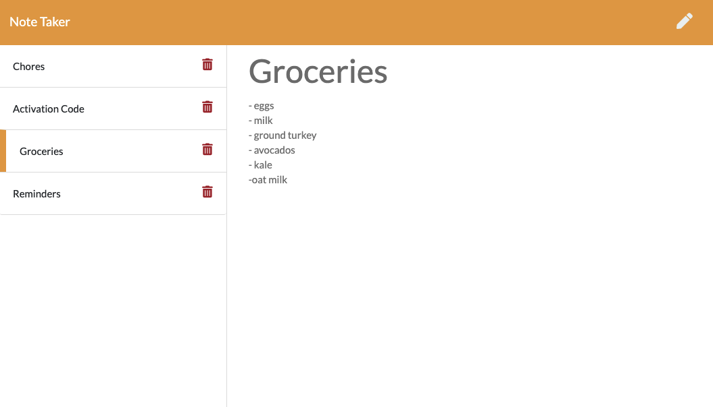

# Note Taker &nbsp;&nbsp;&nbsp;

## Description

A simple note taking app. Users can write notes which are saved to a list in the sidebar. To take a note, click the pencil icon and blank title and text field can be filled out. Notes can be saved by clicking the save icon in the top right. To view a saved note, click one of the saved notes on the left-hand side. Notes can be deleted by clicking the trash can icon. 

The app runs on a node server and is deployed via heroku.

The app can be found [here](https://polar-sea-04536.herokuapp.com/).

# Table of Contents
1. [Built Using](#built-using)
2. [Questions](#questions)
3. [License](#license)

## Built Using
- HTML
- CSS
- Bootstrap
- JavaScript
- Node.js
- Express.js
- Heroku

## Questions
For additional questions, contact Amelia:

GitHub: [amelia-was](https://github.com/amelia-was)

## License
Under the MIT license, this material is free to modify and distribute for commercial or private use. See [here](https://opensource.org/licenses/MIT) for more details.